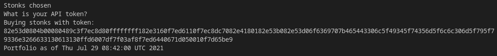
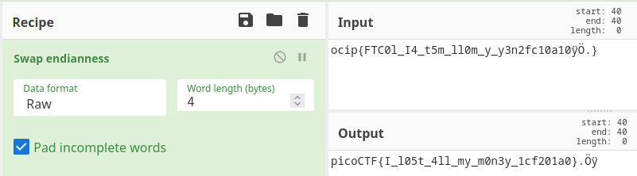

# Stonks

## Overview

* Points: 20
* Category: Binary Exploitation
* Author: Madstacks

## Description
> I decided to try something noone else has before. I made a bot to automatically trade stonks for me using AI and machine learning. I wouldn't believe you if you told me it's unsecure! [vuln.c](https://mercury.picoctf.net/static/17ba7f9351aca192c45833c658742fe5/vuln.c) `nc mercury.picoctf.net 27912`

## Hints

1. Okay, maybe I'd believe you if you find my API key.

## Approach

1. By looking at the code in the .c file, we can see that the printf calls on line 92-93 arent't properly done, opening a string format vulnerability. You can also verify this by trying to execute `nc mercury.picoctf.net 27912`, then input 1 to start buying stonks and then input %p or %x. The program will reply with hexadecimal characters.
2. Use this exploit a long series of %x to get a long string of hexadecimal characters. You can run this shortcut script to get a fast result `echo 1; python -c "print('%x'*30)") | nc mercury.picoctf.net 27912`.
You should get this output: 
3. Copy the result and convert it to an ASCII string. You can use an online tool to easily convert it, such as CyberChef. The result should look like this
```
.å=..°..H.?~ÈØ.ÿÿÿñ.ã..~Ö..~ÈÜp.ä...å;..SÐocip{FTC0l_I4_t5m_ll0m_y_y3n2fc10a10ÿÖ.}÷ð:ø÷íd@g....÷Ö[é
```
Clean the result by removing the initial and final characters, they are in excess:

```
ocip{FTC0l_I4_t5m_ll0m_y_y3n2fc10a10ÿÖ.}
```
4. Due to endiannes, every block of 4 characters looks swapped, so we have to revert it.
You can use CyberChef this time too to get a faster result:

5. Remove the last 3 characters and there is the flag!

## Flag

<details>
<summary>Click to view the flag</summary>

__picoCTF{I_l05t_4ll_my_m0n3y_1cf201a0}__
</details>