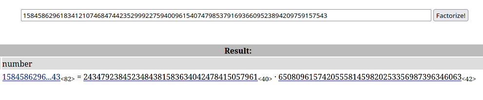

# Mind your Ps and Qs

## Overview

* Points: 20
* Category: Cryptography
* Author: Sara

## Description
In RSA, a small e value can be problematic, but what about `N`? Can you decrypt this? [values](https://mercury.picoctf.net/static/b9ddda080c56fb421bf30409bec3460d/values)

## Hints

1. Bits are expensive, I used only a little bit over 100 to save money

## Approach

1. The file contains some values used in RSA encryption:
```python
Decrypt my super sick RSA:
c: 964354128913912393938480857590969826308054462950561875638492039363373779803642185
n: 1584586296183412107468474423529992275940096154074798537916936609523894209759157543
e: 65537
```
2. In RSA, the N value is made up by multiplying two primes togheter, P and Q. These two primes are essential to get the public (e) and the private (d) keys used for encryption and dectryption. The challenge already gives us the public key that was used to encrypt the flag (c)
3. We must find the two primes that define N. We can achieve this through creating a script that would take way too long to execute due to N being a large number (actually not so large as we'll see in a moment), or we can use online databases that already contain the answer, such as [FactorDB](factordb.com).
You should get this result: 
4. Once we get the two primes, we can write a [python script](solve.py) that calculates the private key (d), and then decrypts the chypertext (c)

## Flag

<details>
<summary>Click to view the flag</summary>

__picoCTF{sma11_N_n0_g0od_73918962}__
</details>