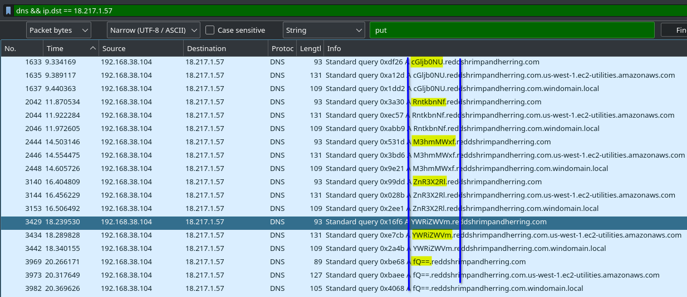

# Wireshark twoo twooo two twoo...

## Overview

* Points: 100
* Category: Foresincs
* Author: Dylan

## Description
Can you find the flag? [shark2.pcapng](https://mercury.picoctf.net/static/719e81d6fbb6b3157624268588fc0de8/shark2.pcapng)

## Hints

1. Did you really find _the_ flag?
2. Look for traffic that seems suspicious.

## Approach

1. Scanning through the streams as done in [this challenge](../Wireshark%20doo%20dooo%20do%20doo.../), the 6th stream contains a GET request done to a `/flag` page. This request's response contains the string `picoCTF{bfe48e8500c454d647c55a4471985e776a07b26cba64526713f43758599aa98b}`, which however isn't the real flag (converting it from base64 or hexadecimal gives out no good output).
The 11th stream also contains the same request/response, which over gives out a different string `picoCTF{bda69bdf8f570a9aaab0e4108a0fa5f64cb26ba7d2269bb63f68af5d98b98245}`. There are many more streams that give out a fake flag, so they are clearly a distraction as the first given hint suggests.
2. Searching through other types of requests, we can see a PUT request to the page `/latest/api/token` containing the token `AQAAANdL16XINqtaIfPEd4oSsoqp95pLlVW4Iavm0x93mlJlUw-LqQ==`, which doesn't give out a nice output after being converted from base64 (so this is just another fake flag!)
3. Looking for other types of suspicious traffic, we can see that there are a __lot__ of DNS requests to different subdomains (the main domain seems to be `reddshrimpandherring.com`). These communications happen between three IPs: 8.8.8.8, 192.168.38.104 and 18.217.1.57. However, only a few of these requests seem to have the last IP as a destination. We can find all of them by applying this filter `dns && ip.dst == 18.217.1.57`.
4. As we can see, every request contains a weird subdomain written in gibberish.

If we add these up togheter, we get the string `cGljb0NURntkbnNfM3hmMWxfZnR3X2RlYWRiZWVmfQ==`, which after being decoded from base64 gives out the flag

## Flag

Click to view the flag

__picoCTF{dns_3xf1l_ftw_deadbeef}__

