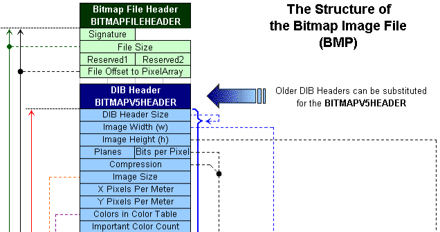
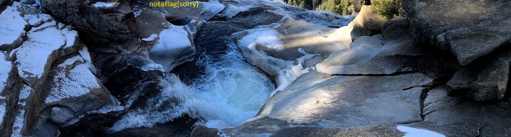

# tunn3l v1s10n   

## Overview

* Points: 40
* Category: Foresincs
* Author: Danny

## Description
> We found this [file](https://mercury.picoctf.net/static/01be2b38ba97802285a451b94505ea75/tunn3l_v1s10n). Recover the flag.

## Hints

1. Weird that it won't display right...

## Approach

1. First of all we have to understand what type of file this is, so we execute `file tunn3l_v1s10n`. The output isn't much of an help, since it simply says that's it's a file containing some data. Looks like we have to find another way to find what type of file this is.
2. We can execute `hexdump -C tunn3l_v1s10n | head -10` to get a dump of the first 10 lines of the data.
```
00000000  42 4d 8e 26 2c 00 00 00  00 00 ba d0 00 00 ba d0  |BM.&,...........|
00000010  00 00 6e 04 00 00 32 01  00 00 01 00 18 00 00 00  |..n...2.........|
00000020  00 00 58 26 2c 00 25 16  00 00 25 16 00 00 00 00  |..X&,.%...%.....|
00000030  00 00 00 00 00 00 23 1a  17 27 1e 1b 29 20 1d 2a  |......#..'..) .*|
00000040  21 1e 26 1d 1a 31 28 25  35 2c 29 33 2a 27 38 2f  |!.&..1(%5,)3*'8/|
00000050  2c 2f 26 23 33 2a 26 2d  24 20 3b 32 2e 32 29 25  |,/&#3*&-$ ;2.2)%|
00000060  30 27 23 33 2a 26 38 2c  28 36 2b 27 39 2d 2b 2f  |0'#3*&8,(6+'9-+/|
00000070  26 23 1d 12 0e 23 17 11  29 16 0e 55 3d 31 97 76  |&#...#..)..U=1.v|
00000080  66 8b 66 52 99 6d 56 9e  70 58 9e 6f 54 9c 6f 54  |f.fR.mV.pX.oT.oT|
00000090  ab 7e 63 ba 8c 6d bd 8a  69 c8 97 71 c1 93 71 c1  |.~c..m..i..q..q.|
```
As we can see from the first line, we're dealing with a BMP file. We can rename the file to `tunn3l v1s10n.bmp` and try to open it in an image viewer, but this still fails. The file is probably corrupted.
3. After giving another quick look to the first lines of the hexdump, we can see two suspicious 4-byte values: `ba d0 00 00` followed by another `ba d0 00 00`. These values were probably altered, thus corrupting the file
4. According to BMP documentation, the first 4-byte value represents an offset to the pixel array, while the second represents BMP DIB Header Size.



The DIB Header Size should be a constant, always having the same value, 40 (0x28). The pixel array is located immediately after the DIB Header chunk. So, to jump to raw pixels, we need to skip a total of 14 + 40 bytes (0x36)
5. After manually editing the pixel data offset to point to 0x36 usign [hexed.it](https://hexed.it), and setting BMP header size to 0x28, the image finally opens properly. But there is a catch: the "fixed" image shows the fake flag `notaflag{sorry}`.



6. By inspecting this “corrected” image with `exiftool` we can see that the total image size appears to be 2893400 bytes, while the image resolution is only 1134x307. This means that the image is showing only part of its pixels!
7. By looking again on the Internet for the BMP file structure, we can see find that the group of 4-bytes starting from the offset 0x16 defines the display height of the image. We can edit this value to show more pixels (setting it to `32 04 00 00` should be enough), revealing the full image.


## Flag

<details>
<summary>Click to view the flag</summary>

__picoCTF{qu1t3_a_v13w_2020}__
</details>