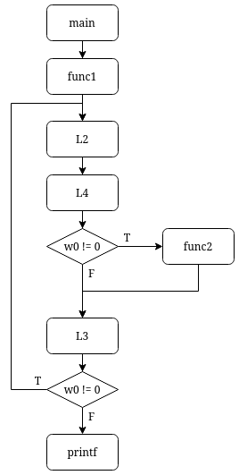

# ARMssembly 3

## Overview

* Points: 130
* Category: Reverse Engineering
* Author: Dylan McGuire

## Description
> What integer does this program print with argument `597130609`? File: [chall_3.S](https://mercury.picoctf.net/static/853a1bc2eb2edbfa6651814cddd75a3b/chall_3.S) Flag format: picoCTF{XXXXXXXX} -> (hex, lowercase, no 0x, and 32 bits. ex. 5614267 would be picoCTF{0055aabb})


## Hints

1. beep boop beep boop...

## Approach

1. Similiar to the [previous one](../ARMssembly%202/), this program involves a loop. However, this time we have a twist!

2. The program starts by executing the `func1` procedure, setting the main registers and branching to `L2`, where the `w0` register gets compared with `0`, branching to `L4` in case they aren't equal or else returning to `main`.
In `L4`, a __bitwise AND__ operation is applied to `w0` and `1`, storing the result in w0. Since only odd numbers have the first bit (from the right) set to 1, the AND operation will result as a `0` every time `w0` is a pair number or as a `1` if it is an odd number (i.e. 5 & 1 ----> 00000101 & 00000001 = 00000001).
Then, the program compares again `w0` with `0`, branching to `L3` in case they're equal or else branching to `func2`, where the memory address `[x29 + 44]` will get incremented by `3`.
Since the branching with `func2` is done using a `bl` statement, the register containing the return address will update, meaning that the `ret` statement found at the end of func2 will return where the last branching happened and keep executing downwards, reaching `L3`.
Once `L3` in done, the program will continue downwards, reaching again `L2` (this is where the loop happens)

4. Once we have broken down the program flow, we can convert everything that we have found into the following __flow diagram__:


5. We can now write a python script that replicates the .s program to find the answer:
```python
def func1(w0):

    x29_28 = w0
    x29_44 = 0
    w0 = x29_28

    print("w0: {:10} | [x29 + 28]: {:10} | [x29 + 44]: {:10}".format(w0, x29_28, x29_44))

    while w0 != 0:
        w0 = x29_28

        w0 = w0 & 1

        if w0 != 0:
            #run func2
            w0 = x29_44
            w0 = w0 + 3
            x29_44 = w0

        #else jump straight to L3
        w0 = x29_28
        w0 = w0 >> 1
        x29_28 = w0

        print("w0: {:10} | [x29 + 28]: {:10} | [x29 + 44]: {:10}".format(w0, x29_28, x29_44))

    w0 = x29_44
    return w0

#--------- MAIN

w1 = func1(597130609)
print("The final value is: {} (hex: {:x})".format(w1, w1))
```

6. Once we run the script, we get the following output:
```bash
w0:  597130609 | [x29 + 28]:  597130609 | [x29 + 44]:          0
w0:  298565304 | [x29 + 28]:  298565304 | [x29 + 44]:          3
w0:  149282652 | [x29 + 28]:  149282652 | [x29 + 44]:          3
w0:   74641326 | [x29 + 28]:   74641326 | [x29 + 44]:          3
w0:   37320663 | [x29 + 28]:   37320663 | [x29 + 44]:          3
w0:   18660331 | [x29 + 28]:   18660331 | [x29 + 44]:          6
w0:    9330165 | [x29 + 28]:    9330165 | [x29 + 44]:          9
w0:    4665082 | [x29 + 28]:    4665082 | [x29 + 44]:         12
w0:    2332541 | [x29 + 28]:    2332541 | [x29 + 44]:         12
w0:    1166270 | [x29 + 28]:    1166270 | [x29 + 44]:         15
w0:     583135 | [x29 + 28]:     583135 | [x29 + 44]:         15
w0:     291567 | [x29 + 28]:     291567 | [x29 + 44]:         18
w0:     145783 | [x29 + 28]:     145783 | [x29 + 44]:         21
w0:      72891 | [x29 + 28]:      72891 | [x29 + 44]:         24
w0:      36445 | [x29 + 28]:      36445 | [x29 + 44]:         27
w0:      18222 | [x29 + 28]:      18222 | [x29 + 44]:         30
w0:       9111 | [x29 + 28]:       9111 | [x29 + 44]:         30
w0:       4555 | [x29 + 28]:       4555 | [x29 + 44]:         33
w0:       2277 | [x29 + 28]:       2277 | [x29 + 44]:         36
w0:       1138 | [x29 + 28]:       1138 | [x29 + 44]:         39
w0:        569 | [x29 + 28]:        569 | [x29 + 44]:         39
w0:        284 | [x29 + 28]:        284 | [x29 + 44]:         42
w0:        142 | [x29 + 28]:        142 | [x29 + 44]:         42
w0:         71 | [x29 + 28]:         71 | [x29 + 44]:         42
w0:         35 | [x29 + 28]:         35 | [x29 + 44]:         45
w0:         17 | [x29 + 28]:         17 | [x29 + 44]:         48
w0:          8 | [x29 + 28]:          8 | [x29 + 44]:         51
w0:          4 | [x29 + 28]:          4 | [x29 + 44]:         51
w0:          2 | [x29 + 28]:          2 | [x29 + 44]:         51
w0:          1 | [x29 + 28]:          1 | [x29 + 44]:         51
w0:          0 | [x29 + 28]:          0 | [x29 + 44]:         54
The final value is: 54 (hex: 36)
```

7. We now have to format the flag as stated in the description

## Flag

<details>
<summary>Click to view the flag</summary>

__picoCTF{00000036}__
</details>
