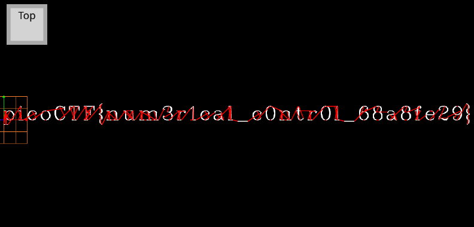

# speeds and feeds

## Overview

* Points: 50
* Category: Reverse Engineering
* Author: Ryan Ramseyer

## Description
There is something on my shop network running at `nc mercury.picoctf.net 20301`, but I can't tell what it is. Can you?

## Hints

1. What language does a CNC machine use?

## Approach

1. When we connect to the given netcat server we get a strange output where every line seems to have the following pattern: `{instruction/command starting with a G} [value]`.
2. As the hint suggests, this could be code used by a [CNC machine](https://en.wikipedia.org/wiki/Numerical_control). After doing some research on the Internet reading docs, we can tell that this is [G-code](https://en.wikipedia.org/wiki/Numerical_control#G-codes), used to achieve precise cuts with a CNC machine after calculating the correct speeds and feeds values (cutting speed and feed rate).
3. After getting the [full output](output.txt) by running `nc mercury.picoctf.net 20301 > output.txt`, we have to run this code on a [simulator](https://nraynaud.github.io/webgcode/) (many thanks to @nraynaud for creating this awesome tool!!). The simulation gives out the following output:

## Flag

Click to view the flag

__picoCTF{num3r1cal_c0ntr0l_68a8fe29}__

